# 1. How to start the App

The smart contract has already been deployed at the following two addresses:

+ 0x515c6d63F87B24Af69b2BA1A332AEc49747797B4
+ 0xb2fB3284a57c50C6539F0BAf0A4374Dc21abce63

To start the app in localhost,

1. we first need to compile the contracts: Under the directory of `lottery`, use command `npx hardhat compile ` Once successful, you should be able to see folder artifacts and cache generated under the directory of src

2. Then run the command `npm start` to start the frontend. You should be able to see the following screenshots:

   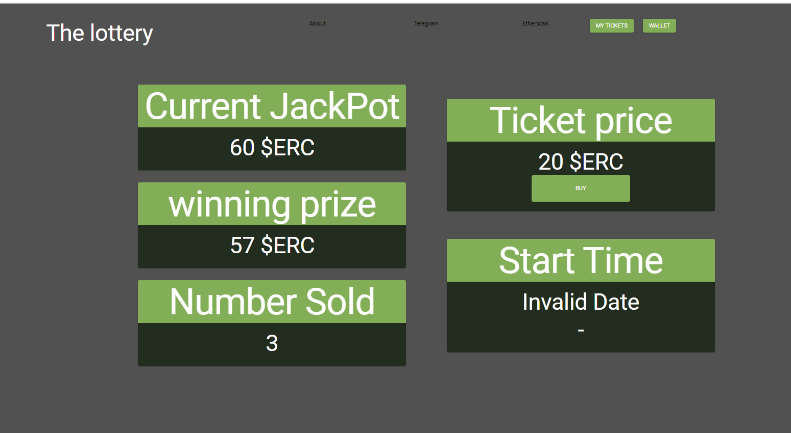

The start up is basically done

# 2. Demo

## 1. How the buyer buys successfully

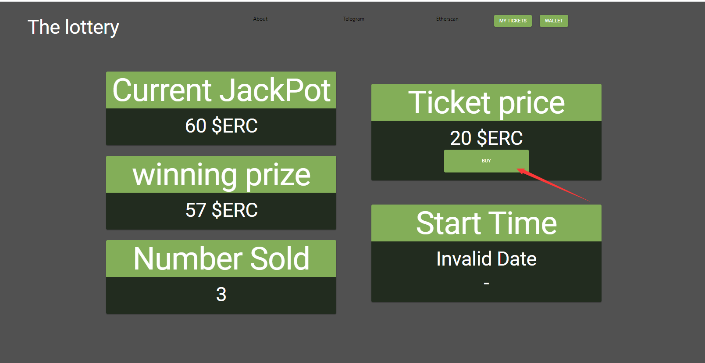

1. First switch the accounts inside the metamask to the buyer account. You can import the buyer account through this private key: `7c852118294e51e653712a81e05800f419141751be58f605c371e15141b007a6`

2. Click the buy button above will direct you to the following page:

   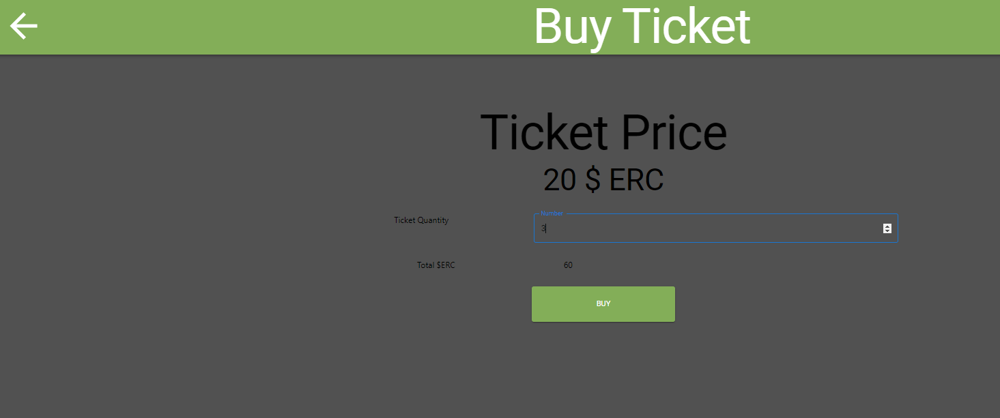

   Enter the number of tickets you want to buy in the ticket quantity field and the total $ERC you need to pay will display below. Here it is 60 ERC. Once you click buy, there will be pop up for you to confirm.

​		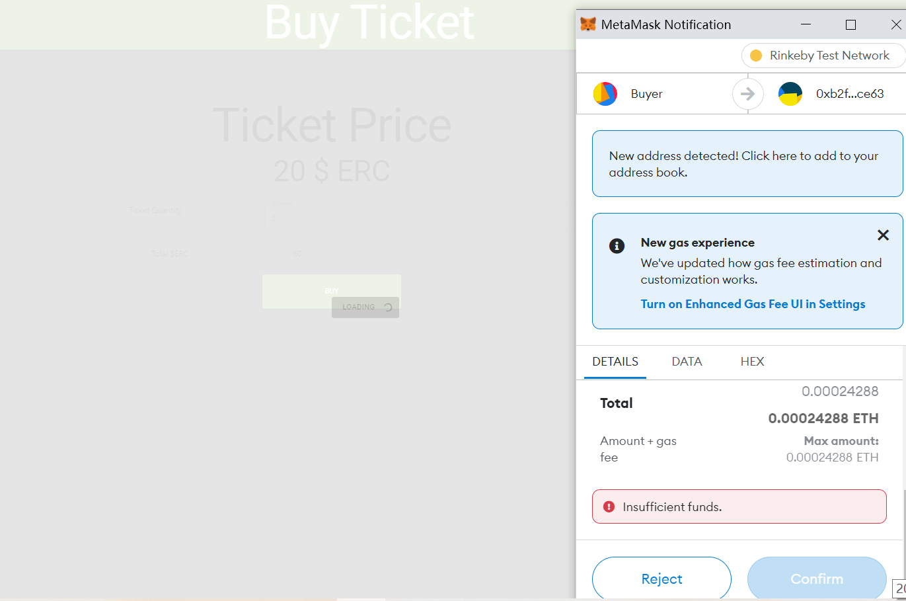

3. Wait for about 15 to 30 seconds, now go to the home page:

   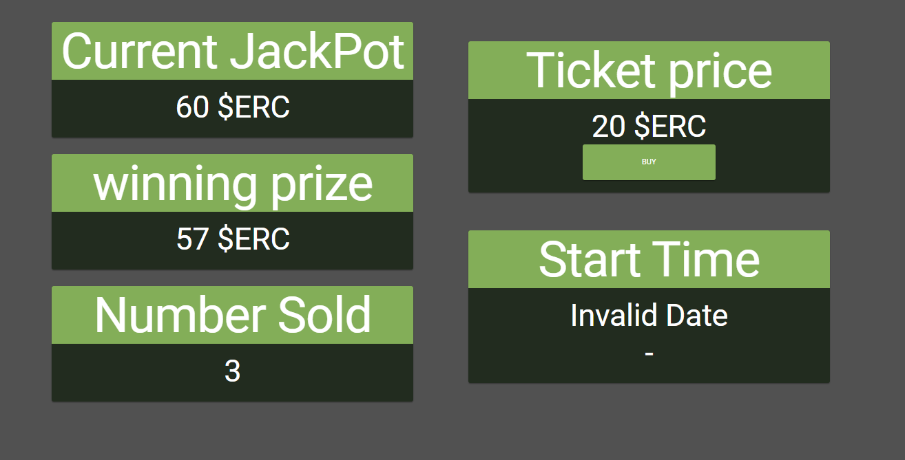

   There Current JackPot will show the balance inside the contract, the winning prize will be 95% of the balance and Number Sold will be updated to include the three tickets you just bought.

   

## 2. How the buyer buys unsuccessfully

Suppose a user does not have any token at all, you can switch to your own account in metamask.

Go to the buy page and input a quantity:

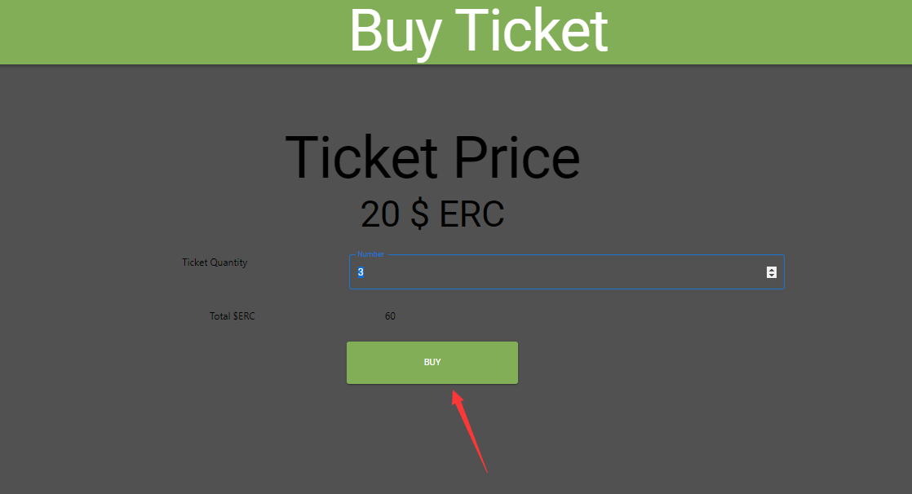

2. There will be a window pop up indicating insufficient balance. This check is done at the frontend.

   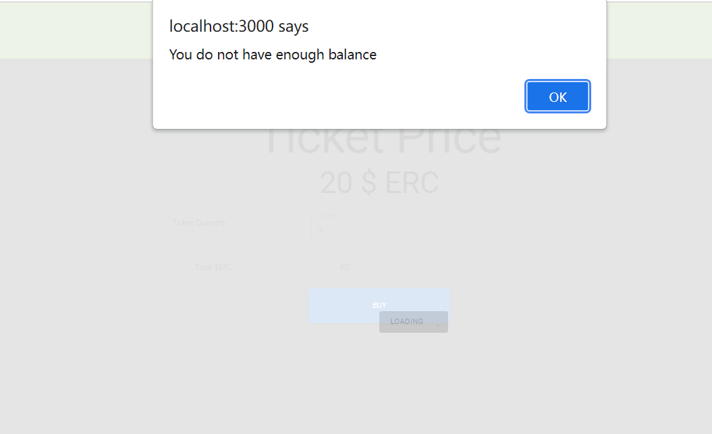

## 3. How manager draw winner successfully

1. Switch to the owner or manager account. Here we can import these accounts through these secret keys:

   + Owner: d71eb3f06462e0ea5d3850e08fb19dec3144c6053a571939bf57b0c605b2ebef
   + Manger 1: 7c852118294e51e653712a81e05800f419141751be58f605c371e15141b007a6
   + Manager 2: 8166f546bab6da521a8369cab06c5d2b9e46670292d85c875ee9ec20e84ffb61

2. Go to the home page and click About:

   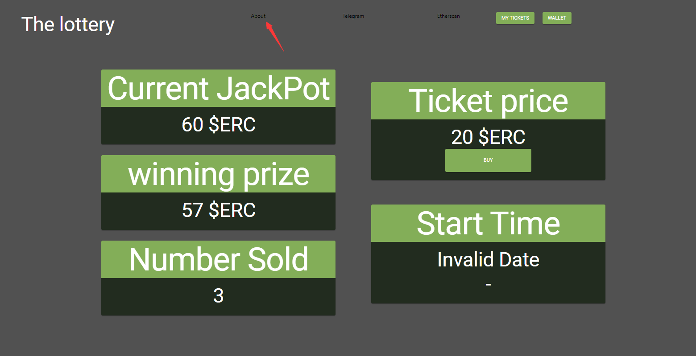

   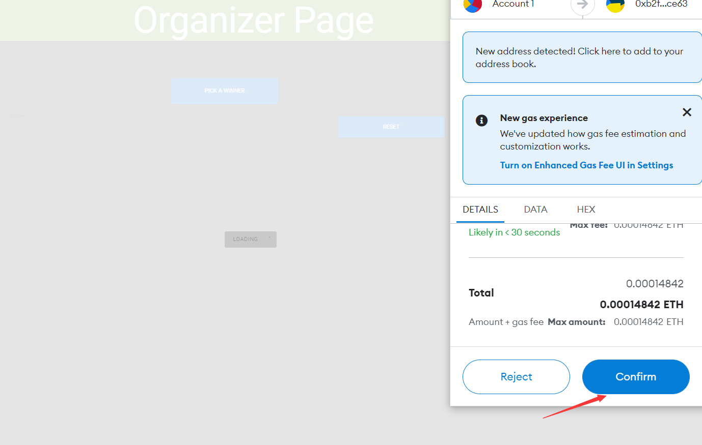

   

2. It will direct you to the Organizer Page. Just click the pick a winner button. Then 95% ERC token will be sent to the winner's address and 5% will be sent to your address automatically. And the next round of lottery will be automatically started, as you can see in the home page. The current Jackpot which is the balance of the contract's account will be set to 0 and the price will be reset to 20, if you change the price of this turn to other number

   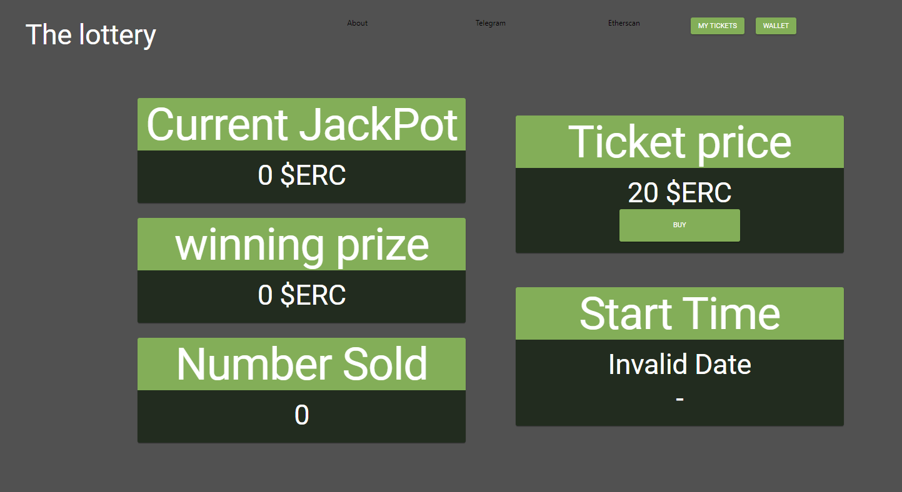

## 4. How the manager draw winner unsuccessfully

+ The owner cannot draw a lottery within 5 minutes after a new round start. If the owner tries to draw a lottery in less than 5 minutes after the new round starts, he should be able to see the pick a winner button be disabled

+ If nobody is buying the tickets, then the owner cannot draw the winner. Then when the owner clicks the pick a winner button, he will get a window pop up filled with error message

## 5. How to reset the price successfully

1. Switch to the owner account in the part of "How manager draw winner successfully"

2. Click the about button at the home page and go to the organizer page

3. Randomly inputs a new price for the ticket and click reset:

   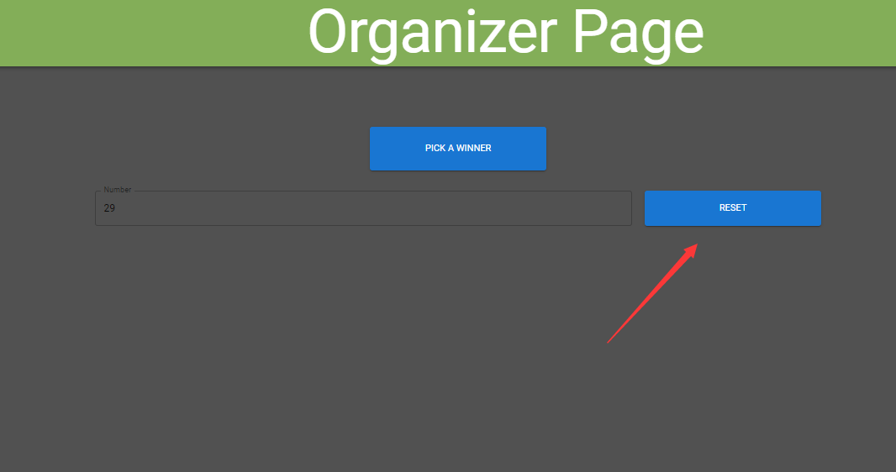

   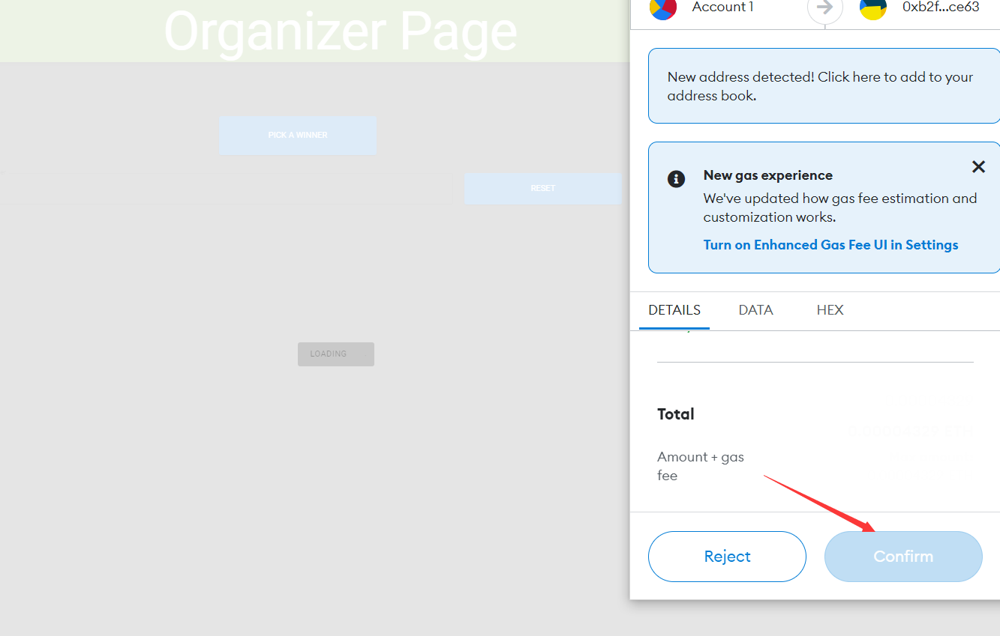

3. Wait for a moment and then go to the home page. You will see the price is now set to 29:

   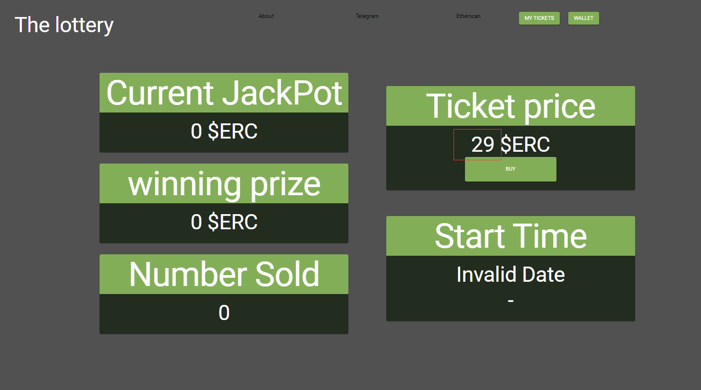

## 6. How to reset the price unsuccessfully

Switch to a non-owner account, you can use your own account. Go to the organizer page

You can see the reset button disabled. If you use a non organizer  and non manager account to go to this page, you will also see the pick a winner button disabled. 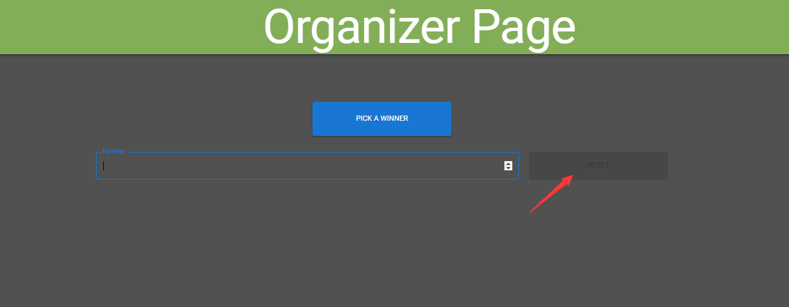

Another such situation occurs is that when there has already been users buying the ticket with the old price. Then the owner could not reset the price. For example, when the owner creates a new round and a user buys the ticket with 20 ERC price. Then if the owner resets the price, he will gets a window pop up filled with error message
